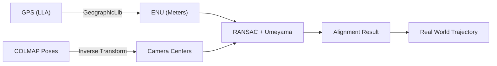

# UAV-Absolute-Orientation 🚀
**无人机三维重建绝对定向与地理对齐工具**

[](https://opensource.org/licenses/MIT)
[](https://isocpp.org/)
[](https://eigen.tuxfamily.org/)

## 简介 (Introduction)
本工具专门用于无人机 3D 重建（如 COLMAP, Gaussian Splatting）的**绝对定向**。它能够将无量纲的 SfM 视觉模型通过 GPS 轨迹精确对齐到真实世界坐标系（WGS84/ENU），解算出比例因子(Scale)、旋转矩阵(Rotation) 和 平移向量(Translation)。

## 工作流程 (Workflow)


## 核心功能 (Key Features)
*   🌍 **高精度转换**：基于 GeographicLib 实现 LLA 与 ENU 坐标系的纳米级转换。
*   🛡️ **异常剔除**：内置 RANSAC 框架，自动识别并过滤 GPS 信号漂移导致的异常跳变点。
*   📏 **模型测距**：内置工具支持通过模型坐标直接反算真实物理距离（米）。
*   ⚙️ **YAML驱动**：全参数外部配置化，无需重新编译即可处理不同项目。

## 环境准备 (Prerequisites)
使用 vcpkg 安装以下依赖：
```bash
vcpkg install eigen3 geographiclib yaml-cpp
```

## 快速使用 (Quick Start)

### 1. 编译 (Build)
```bash
mkdir build && cd build
cmake .. -DCMAKE_TOOLCHAIN_FILE=[vcpkg_path]/scripts/buildsystems/vcpkg.cmake
cmake --build . --config Release
```

### 2. 配置 (Configuration)
编辑 `config.yaml`：
| 参数项 | 说明 | 示例 |
| :--- | :--- | :--- |
| `gps_file` | 无人机 GPS 记录 (CSV) | `../data/gps.csv` |
| `colmap_file` | COLMAP 位姿文件 | `../data/images.txt` |
| `threshold` | RANSAC 容忍误差 (米) | `5.0` (普通) / `0.2` (RTK) |
| `measurements` | 需要测距的模型点对 | `[[x1,y1,z1], [x2,y2,z2]]` |

### 3. 运行 (Run)
```bash
./uav_orientation ../config.yaml
```

## 数据格式规范 (Data Formats)

### 1. GPS 轨迹文件 (CSV)
必须为纯文本 CSV 格式，且**不带表头**（或者确保第一行是注释），列顺序必须严格如下：
`纬度 (Latitude), 经度 (Longitude), 高度 (Altitude)`
*   **示例**：`39.908000, 116.397000, 50.0`
*   **注意**：高度单位为米。

### 2. COLMAP 位姿文件 (images.txt)
必须是 COLMAP 导出的标准 `images.txt` 格式，程序会自动识别以下逻辑：
*   **奇数行**：包含 `IMAGE_ID, QW, QX, QY, QZ, TX, TY, TZ, CAMERA_ID, NAME`。
*   **偶数行**：特征点坐标（程序会自动跳过此行）。
*   **匹配规则**：程序目前按照 GPS 文件的**行号**与 COLMAP 文件中按**文件名排序**后的图像进行 1:1 匹配。

## 输出结果说明 (Output Specification)

### 1. 变换矩阵 (`transform_result.txt`)
该文件存储了将 3D 模型对齐到现实世界的数学参数。对齐公式为：
$$P_{real} = s \cdot R \cdot P_{model} + t$$
*   **scale (s)**: 比例因子，代表模型单位与米之间的比例。
*   **rotation (R)**: 3x3 旋转矩阵，定义了模型的方向。
*   **translation (t)**: 平移向量，定义了模型原点在 ENU 坐标系下的位置。
*   **measurements**: 记录了你在配置文件中定义的测距结果。

**文件示例 (Example)**：
```yaml
scale: 2.000911
rotation:
  1.000000 0.000006 -0.000007
  0.000006 -1.000000 -0.000000
  -0.000007 -0.000000 -1.000000
translation: 0.000000 -0.000079 0.000094
rmse: 0.000074
```

### 2. 对齐轨迹 (`aligned_trajectory.csv`)
该文件可以导入 GIS 或 Excel 软件，包含对齐后的相机位置：
`image_name, enu_east, enu_north, enu_up`
*   单位均为**米 (Meters)**。

## 特色功能：模型测距仪 (Feature: Measurement Tool)
该工具允许你在对齐完成后，直接计算 3D 模型中任意两点间的**真实地理距离**。
*   **常规操作**：
    1.  在 3D 查看软件（如 MeshLab 或 CloudCompare）中点击获取两个点的原始坐标 $[x, y, z]$。
    2.  将坐标填入 `config.yaml` 的 `measurements` 列表中。
    3.  运行程序，结果将自动显示在终端并记录在 `transform_result.txt` 中。
*   **⚡ 极速快照模式 (Snapshot Mode)**：
    如果你已经完成过一次对齐，只需要反复测距，**请将 `config.yaml` 中的 `gps_file` 设为 `""` 或 `"none"`**。
    程序会跳过耗时的数据加载和对齐过程，直接读取上次的 `scale` 瞬间完成新点对的测距。

## 使用指南 (User Guide)

### 🚀 核心工作流 (Workflow)
1.  **数据准备**：将无人机 GPS CSV (纬度,经度,高度) 和 COLMAP 的 `images.txt` 放入 `data` 目录。
2.  **参数配置**：编辑 `config.yaml`。
    *   根据 GPS 精度调整 `ransac.threshold` (RTK 建议 0.2，普通 GPS 建议 5.0)。
    *   在 `measurements` 中填入模型坐标点对进行自动测距。
3.  **执行对齐**：在命令行运行程序并指定配置文件。
4.  **结果分析**：
    *   检查终端输出的 **RMSE** 值（反映对齐精度）。
    *   在 `output/` 目录获取变换矩阵和对齐后的地理轨迹。

### 📊 结果解读 (Interpreting Results)
*   **RMSE < 1.0m**：对齐精度极高，适用于高精度测绘。
*   **Scale Factor**：模型与现实世界的缩放比例，后续 3D 测量的基准。
*   **Inliers**：有效参与对齐的 GPS 点数，数量越多结果越可靠。

## 许可证 (License)
本项目采用 MIT 许可证。

---
*Developed with ❤️ for UAV Reconstruction Community*
